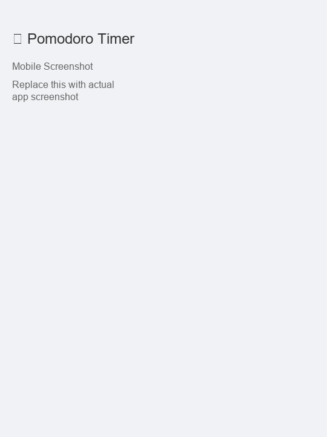

# Pomodoro Focus Timer

A feature-rich Progressive Web App for productivity management using the Pomodoro Technique.



## What is the Pomodoro Technique?

The Pomodoro Technique breaks work into focused 25-minute intervals separated by short breaks. This helps you stay focused, prevent burnout, and track productivity.

## Features

- Complete Pomodoro Timer with focus sessions, short breaks, and long breaks
- Task management: add, track, and complete your tasks
- Productivity stats with 7-day progress tracking
- Multiple themes: Default, Forest, Ocean, and Matrix
- Sound options: notification sounds and ambient backgrounds
- Keyboard shortcuts: Space (start/pause), Alt+S (skip), Alt+R (reset)
- Progressive Web App: install as native app, works offline
- Ambient sounds: rain and coffee shop background audio

## Quick Start

1. Open `index.html` in your browser
2. Add tasks you want to work on
3. Click Start and focus for 25 minutes
4. Take breaks between sessions

## Installation

### Run Locally
1. Clone or download this repository
2. Open `index.html` in your browser
3. No build process required

### Install as PWA
1. Open the app in Chrome, Edge, Safari, or Firefox
2. Look for the install prompt in the address bar
3. Click "Install" to add to your device

### Development Setup
```bash
# Clone the repository
git clone https://github.com/samuelrooke/focuslink-solo.git
cd focuslink-solo

# Run with a local server (optional, recommended for PWA testing)
python -m http.server 8000
# Then visit http://localhost:8000
```

## Usage

1. Add tasks you want to work on
2. Customize timer lengths and sounds in settings
3. Select a theme that helps you focus
4. Start your first Pomodoro session
5. Take breaks when the timer completes
6. Track your daily progress

## Keyboard Shortcuts

| Shortcut | Action |
|----------|--------|
| Space | Start/Pause timer |
| Alt+S | Skip to next session |
| Alt+R | Reset timer |

## Themes

- **Default**: Clean blue theme
- **Forest**: Green nature theme
- **Ocean**: Blue water theme
- **Matrix**: Dark green tech theme

## Sounds

**Notification Sounds**: Ding, Bell, or Silent  
**Ambient Backgrounds**: Rain, Coffee Shop, or None

## Project Structure

```
focuslink-solo/
├── index.html          # Main HTML file
├── styles.css          # All styling and themes
├── script.js           # Application logic
├── manifest.json       # PWA manifest
├── sw.js              # Service worker for offline support
├── images/            # Icons and screenshots
└── sounds/            # Audio files
```

## Technical Details

- Pure HTML/CSS/JavaScript with no frameworks or dependencies
- Progressive Web App with service worker
- Offline capable after first load
- Responsive design for desktop, tablet, and mobile
- Local storage for data persistence

## Browser Support

Works on modern browsers supporting HTML5, ES6, CSS Grid/Flexbox, and Service Workers:
- Chrome/Chromium 90+
- Edge 90+
- Firefox 88+
- Safari 14+
- Mobile browsers (iOS Safari, Chrome Mobile)

## Deployment

**GitHub Pages**: Enable in repository settings, select main branch  
**Netlify/Vercel**: Connect repository, no build command needed  
**Self-hosting**: Upload all files to any web server

## Troubleshooting

**PWA won't install**: Ensure HTTPS (or localhost), check browser support, clear cache  
**Timer not working**: Enable JavaScript, check console for errors  
**Data lost**: Don't use private/incognito mode, check localStorage settings  
**Sounds not playing**: Check autoplay settings, verify sound files exist

## Contributing

Contributions welcome! To contribute:
1. Fork the repository
2. Create a feature branch
3. Make your changes and test in multiple browsers
4. Submit a pull request

Please report bugs with clear reproduction steps and include browser version.

## License

This project is open source and available under the MIT License.

---

Built for productivity using the proven Pomodoro Technique.
